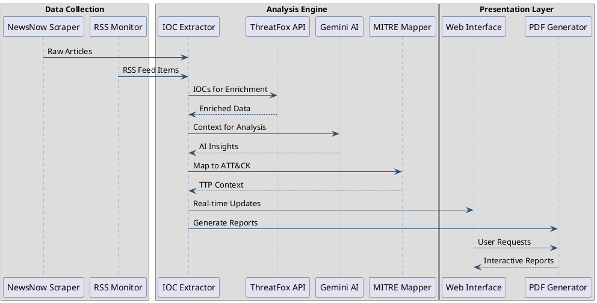

.. _system-architecture:

System Architecture
======================

.. _arch-overview:

Architectural Overview
---------------------------
The AI-Powered Cyber Incident Monitoring Tool is designed with a modular architecture to promote separation of concerns, maintainability, and scalability. The system comprises several key interconnected components that handle distinct stages of the threat monitoring and analysis pipeline, from data ingestion to report presentation.

The architecture emphasizes automated workflows, integration with external intelligence services, and providing actionable information to users through multiple interfaces.

.. _arch-core-components:

Core Components
--------------------
The system is built around the following primary components:

*   **Cyber Article Monitor (`cyber_monitor.py`)**: Responsible for fetching articles from web sources like NewsNow. It handles HTTP requests, parses HTML content, extracts preliminary article details (title, link, timestamp), and performs initial regex-based IOC extraction from titles. It collaborates with the ``IOCAnalyzer`` for deeper analysis.
*   **IOC Analyzer (`ioc_analyzer.py`)**: This is the analytical core of the system. It takes IOCs (or full article content) and:

      *   Integrates with **Google's Gemini AI** for detailed textual analysis, summarization, and structured data extraction (e.g., threat level, impact).
      *   Connects to the **ThreatFox API** to enrich IOCs with external threat intelligence.
      *   Maps IOC characteristics to the **MITRE ATT&CK® framework** using a local cache of MITRE's enterprise data.
      *   Generates comprehensive HTML reports detailing the findings.

*   **Web Interface & API (`web_monitor.py`)**: A FastAPI-based application that provides:

      *   A user interface (built with Jinja2 templates) for real-time monitoring of articles, viewing IOC analyses, submitting IOCs manually, and initiating PCAP scans.
      *   WebSocket communication for pushing real-time updates to connected clients.
      *   HTTP API endpoints for functionalities like fetching recent ThreatFox IOCs, analyzing submitted IOCs, and analyzing submitted article content.

*   **RSS Feed Monitor (`rss_monitor.py`)**: A simpler component specifically designed to fetch and parse data from RSS feeds, such as ThreatPost. It currently acts as a standalone utility for fetching the latest feed items.
*   **MITRE ATT&CK® Cache**: A local JSON file (`mitre_attack_cache.json`) storing the MITRE ATT&CK® enterprise dataset. The ``IOCAnalyzer`` manages this cache, including periodic refreshes, to ensure efficient and up-to-date mapping.

.. .. figure:: _static/component_diagram.png
..    :alt: Component Interaction Diagram
..    :align: center
..    :width: 90%

..    Diagram illustrating the primary components and their key interactions within the system.
.. plantuml::
   :caption: Data Flow Sequence
   :width: 800

   @startuml
   skinparam backgroundColor #FFFFFF
   skinparam sequenceArrowColor #2A4D6E
   skinparam sequenceLifeLineBorderColor #6C8EBF
   skinparam sequenceParticipantBorderColor #2A4D6E

   box "Data Collection"
   participant "NewsNow Scraper" as NS
   participant "RSS Monitor" as RM
   end box

   box "Analysis Engine"
   participant "IOC Extractor" as IE
   participant "ThreatFox API" as TF
   participant "Gemini AI" as GA
   participant "MITRE Mapper" as MM
   end box

   box "Presentation Layer"
   participant "Web Interface" as WI
   participant "PDF Generator" as PG
   end box

   NS -> IE : Raw Articles
   RM -> IE : RSS Feed Items
   IE -> TF : IOCs for Enrichment
   TF --> IE : Enriched Data
   IE -> GA : Context for Analysis
   GA --> IE : AI Insights
   IE -> MM : Map to ATT&CK
   MM --> IE : TTP Context
   IE -> WI : Real-time Updates
   IE -> PG : Generate Reports
   WI -> PG : User Requests
   PG --> WI : Interactive Reports
   @enduml

.. _arch-data-flow:

Data Flow
--------------
The data flow within the system can be summarized as follows:

1.  **Data Ingestion**:

      *   ``CyberMonitor`` periodically fetches articles from NewsNow.
      *   ``RSSMonitor`` (conceptually, or if integrated into a main loop) fetches data from ThreatPost RSS.

2.  **Initial Processing**:

      *   ``CyberMonitor`` parses HTML, extracts article metadata, and performs regex-based IOC extraction from titles.

3.  **IOC/Article Analysis (via `IOCAnalyzer`)**:

      *   Extracted IOCs are sent to ``IOCAnalyzer``.
      *   IOCs are enriched via the **ThreatFox API**.
      *   Enriched data and original IOC context are analyzed by **Gemini AI** for threat level, impact, recommendations, etc.
      *   IOCs are mapped to **MITRE ATT&CK® TTPs**.
      *   Full article content can also be submitted for Gemini AI summarization and analysis.

4.  **Reporting**:

      *   ``IOCAnalyzer`` generates an HTML report for each analyzed IOC.

5.  **Presentation & Interaction (via `WebMonitor`)**:

      *   New articles and their analyses are stored and broadcast via WebSockets to the web interface.
      *   Users can view articles, IOC reports, and submit IOCs or article text for on-demand analysis through the web UI.
      *   Users can initiate PCAP file scans for specific IOCs.
      *   The CLI (conceptually, as per FR15) would allow direct IOC submission to ``IOCAnalyzer`` and report retrieval.

   Diagram illustrating the sequential flow of data from collection through analysis to presentation.

.. _arch-technologies:

Technologies Used
----------------------
The project leverages a range of modern technologies:

*   **Programming Language**: Python 3.8+
*   **Web Framework**: FastAPI (for the web server and API endpoints)
*   **Templating Engine**: Jinja2 (for rendering HTML in the web interface)
*   **AI Service**: Google Gemini AI (via the `google-generativeai` SDK for IOC analysis and content summarization)
*   **Threat Intelligence API**: ThreatFox API (abuse.ch) (for IOC enrichment)
*   **Cybersecurity Framework**: MITRE ATT&CK® (enterprise dataset for TTP mapping)
*   **Data Fetching/Parsing**: `requests` (HTTP calls), `BeautifulSoup4` (HTML parsing), `feedparser` (RSS parsing)
*   **Data Handling**: `stix2` (for MITRE data), `json`
*   **CLI Utilities**: `rich` (for potentially enhanced CLI output, though primarily used by IOCAnalyzer for internal formatting that gets converted to HTML), `tqdm` (progress bars for downloads)
*   **Environment Management**: `python-dotenv` (for managing API keys via ``.env`` files)
*   **Network Analysis (for PCAP)**: `tshark` (command-line tool, part of Wireshark)
*   **Web Server (for FastAPI)**: Uvicorn
*   **Version Control**: Git

