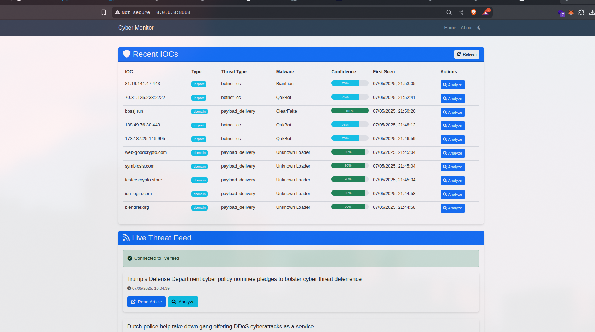
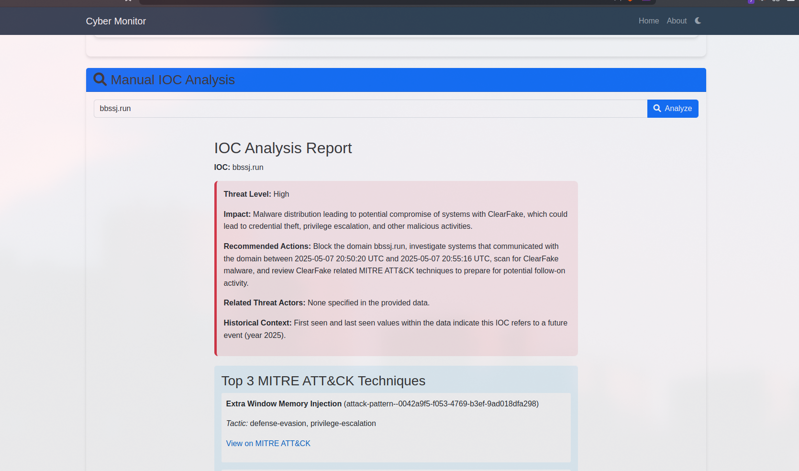

.. _user-guide:

User Guide
=============

This guide provides instructions on how to set up, run, and use the AI-Powered Cyber Incident Monitoring Tool.

.. _user-guide-installation:

Installation and Setup
---------------------------

   .. _user-guide-prerequisites:

Prerequisites
^^^^^^^^^^^^^^^^^^^^
Before installing the tool, ensure you have the following prerequisites:

*   **Python**: Version 3.8 or higher.
*   **pip**: Python package installer (usually comes with Python).
*   **Git**: For cloning the repository.
*   **tshark**: The command-line utility for Wireshark. This must be installed and accessible in your system's PATH for PCAP analysis functionality. Installation varies by OS:

      *   **Linux (Debian/Ubuntu)**: ``sudo apt update && sudo apt install tshark``
      *   **Linux (Fedora)**: ``sudo dnf install wireshark-cli``
      *   **macOS (using Homebrew)**: ``brew install wireshark`` (tshark is included)
      *   **Windows**: Install Wireshark from the official website and ensure the installation directory (containing tshark.exe) is added to your system's PATH environment variable.

*   **Internet Access**: Required for fetching articles, accessing ThreatFox API, and Google Gemini AI API.

.. _user-guide-installation-steps:

Installation Steps
^^^^^^^^^^^^^^^^^^^^^^^^^
1.  **Clone the Repository**:

   Open your terminal or command prompt and navigate to the directory where you want to install the project. Then run:
     .. code-block:: bash

       git clone https://github.com/GGal1leo/CYB_FYP/ 
       cd CYB_FYP # Navigate into the cloned project directory

2.  **Create a Virtual Environment** (Recommended):

   It's highly recommended to use a virtual environment to manage project dependencies.
     .. code-block:: bash

       python -m venv venv

3.  **Activate the Virtual Environment**:

   *   **Linux/macOS**:

   .. code-block:: bash

      source venv/bin/activate

   *   **Windows (Command Prompt)**:

   .. code-block:: bash

      venv\\Scripts\\activate.bat

   *   **Windows (PowerShell)**:

   .. code-block:: bash

      .\\venv\\Scripts\\Activate.ps1

4.  **Install Dependencies**:

   With the virtual environment activated, install the required Python packages:
   
   .. code-block:: bash

      pip install -r requirements.txt

5.  **Configure Environment Variables**:

   The tool requires API keys for Google Gemini AI. These are managed using a ``.env`` file.
   
   *   Copy the example environment file:

      .. code-block:: bash

         cp .env.example .env
   
   *   Edit the ``.env`` file with your actual API key:

      .. code-block:: text

         AI_API="YOUR_GEMINI_API_KEY_HERE"

      Replace ``YOUR_GEMINI_API_KEY_HERE`` with your valid Google Gemini API key.

.. _user-guide-running:

Running the Application
----------------------------

.. _user-guide-running-web:

Web Interface
^^^^^^^^^^^^^^^^^^^^
To start the web interface and background monitoring tasks:

1.  Ensure your virtual environment is activated.
2.  Navigate to the project's root directory in your terminal.
3.  Run the Uvicorn server:

   .. code-block:: bash

     uvicorn web_monitor:app --reload

   *   ``web_monitor:app`` tells Uvicorn to find the FastAPI application instance named ``app`` within the ``web_monitor.py`` file.
   *   ``--reload`` enables auto-reloading, so the server will restart if you make changes to the Python code (useful for development).

4.  Once the server is running (it will typically say "Application startup complete" and indicate it's listening on ``http://127.0.0.1:8000``), open your web browser and navigate to: ``http://127.0.0.1:8000``

.. _user-guide-running-cli-monitor:

Command-Line Monitoring (`cyber_monitor.py`)
^^^^^^^^^^^^^^^^^^^^^^^^^^^^^^^^^^^^^^^^^^^^^^^^^^^
The ``cyber_monitor.py`` script can be run directly to perform continuous monitoring and print results to the console (as seen in its ``if __name__ == "__main__":`` block). This is primarily for development or a headless monitoring setup.

1.  Ensure your virtual environment is activated and ``.env`` is configured.
2.  Run:

   .. code-block:: bash

     python cyber_monitor.py

   This will start fetching articles from NewsNow and analyzing them, printing output to the terminal. Note that this runs independently of the web interface's background task unless its internal logic is modified.

.. _user-guide-running-cli-rss:

RSS Feed Fetching (`rss_monitor.py`)
^^^^^^^^^^^^^^^^^^^^^^^^^^^^^^^^^^^^^^^^^^^
The ``rss_monitor.py`` script is a simple utility to fetch the latest from the ThreatPost RSS feed.

1.  Ensure your virtual environment is activated.
2.  Run:

   .. code-block:: bash

     python rss_monitor.py

   This will print the latest article title from ThreatPost to the console.

.. _user-guide-web-features:

Using the Web Interface
----------------------------
The web interface provides a central dashboard for monitoring and analyzing cyber threats.

*   **Dashboard**:

      *   Displays a list of recently monitored articles from NewsNow. New articles appear in real-time at the bottom of the list.
      *   Each article entry shows the title (clickable), publication time, and any initially extracted IOCs.
      *   A "Demo Article" is always present for demonstration purposes.

*   **Viewing Article Analysis**:

      *   Clicking on an article title will typically expand or show the AI-generated analysis for that article (if this functionality is fully implemented in the ``monitor.html`` template to display ``analysis['ioc_analysis']`` for each article).

*   **Manual IOC Analysis**:

      *   Find the "Analyze IOC" section.
      *   Enter an IOC (e.g., an IP address, domain, URL, or hash) into the input field.
      *   Click "Analyze". The system will query ThreatFox, use Gemini AI for analysis, map to MITRE ATT&CK®, and check against a local PCAP file.
      *   The detailed HTML report and PCAP scan results will be displayed on the page.

*   **Manual Article Content Analysis**:

      *   Find the "Analyze Article Content" section.
      *   Paste the full text of a news article or threat report into the text area.
      *   Click "Analyze Article". Gemini AI will summarize the content, identify key entities, and assess the threat.
      *   The HTML formatted analysis will be displayed.

*   **Recent ThreatFox IOCs**:

      *   A section on the page (typically "Recent IOCs from ThreatFox") displays the last 10 IOCs reported to ThreatFox in the past day.

   Layout of the web interface dashboard, showing recent articles and analysis sections.

   Example of how a detailed IOC analysis report might be displayed in the web interface.

.. _user-guide-cli-features:

Using the Command-Line Interface (CLI) for IOC Analysis
------------------------------------------------------------
Functional Requirement FR15 specifies a CLI for submitting an IOC for analysis and receiving a report. While ``cyber_monitor.py`` and ``rss_monitor.py`` have command-line execution modes for their specific tasks, a dedicated CLI for on-demand IOC analysis as per FR15 would typically involve:

1.  A script (e.g., ``cli_analyzer.py``, or an ``if __name__ == "__main__":`` block in ``ioc_analyzer.py``) that accepts an IOC as a command-line argument.
2.  This script would then use the ``IOCAnalyzer`` class to:

   *   Call ``generate_report(ioc_argument)``.
   *   Either print a textual summary of the report to the console or save the HTML report (from ``display_report()``) to a file and print the file path.

**Example (Conceptual Usage)**:
Assuming such a CLI script (e.g., ``cli_analyzer.py``) is created:

.. code-block:: bash

   python cli_analyzer.py --ioc "1.2.3.4"
   # Or:
   python cli_analyzer.py --ioc "evil-domain.com" --output-html report_for_evil_domain.html

Currently, the provided codebase focuses ``ioc_analyzer.py`` as a library. To fully meet FR15, a small wrapper script or main execution block in ``ioc_analyzer.py`` would be beneficial to provide this direct CLI IOC analysis capability.

