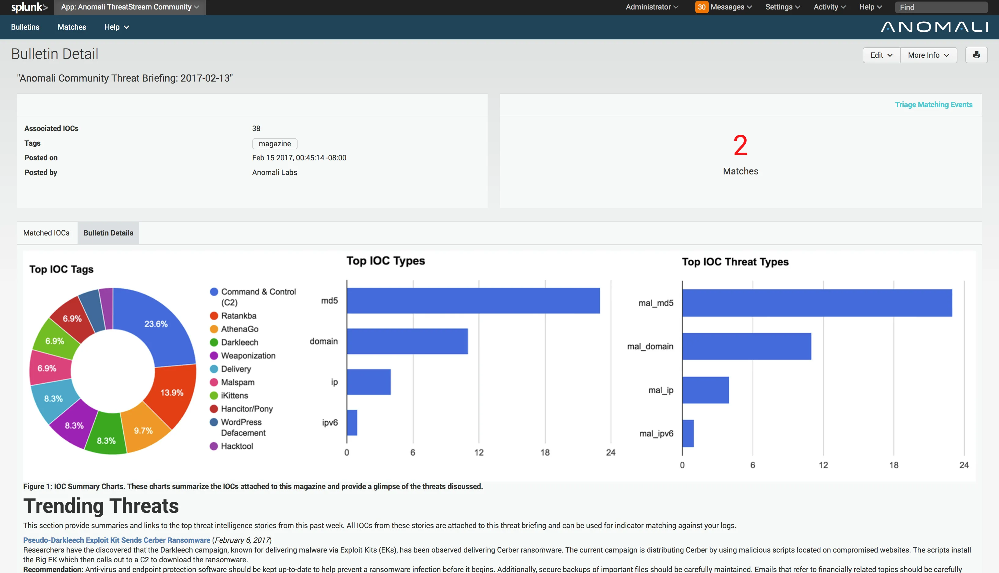

Research Manual

By

Daniel Vetrila (C00271021)

# Table Of Contents

[Table Of Contents](#table-of-contents)

[Abstract](#abstract)

[Project Description](#project-description)

[Introduction](#introduction)

[Background & Motivation](#background-motivation)

[Considerations: Programming Language
Selection](#considerations-programming-language-selection)

[Conclusion](#conclusion)

[Objectives](#objectives)

[Automate Threat Data Collection](#automate-threat-data-collection)

[Leverage Gemini AI for IOC
Identification](#leverage-gemini-ai-for-ioc-identification)

[Enrich IOC Data via ThreatFox API](#enrich-ioc-data-via-threatfox-api)

[Contrast Threats Against MITRE ATT&CK
Framework](#contrast-threats-against-mitre-attck-framework)

[Implement Threat Ranking Based on Organization’s
Profile](#implement-threat-ranking-based-on-organizations-profile)

[Generate Automated Reports](#generate-automated-reports)

[Provide Multi-Platform Access (Web and
CLI)](#provide-multi-platform-access-web-and-cli)

[Enhance Incident Response
Efficiency](#enhance-incident-response-efficiency)

[Ensure Scalability and
Adaptability](#ensure-scalability-and-adaptability)

[Overview of Anomali ThreatStream](#overview-of-anomali-threatstream)

[Similarities to this Cyber Incident Monitoring
Tool](#similarities-to-this-cyber-incident-monitoring-tool)

[Distinguishing Features of Our
Tool](#distinguishing-features-of-our-tool)

[Conclusion](#conclusion-1)

[Impact of Cyber Incident Monitoring Tool on Cybersecurity
Roles](#impact-of-cyber-incident-monitoring-tool-on-cybersecurity-roles)

[Conclusion](#conclusion-2)

[User Interface](#user-interface)

[Web Interface](#web-interface)

[Key Features](#key-features)

[Design Considerations](#design-considerations)

[Command-Line Interface (CLI)](#command-line-interface-cli)

[Key Features](#key-features-1)

[Design Considerations](#design-considerations-1)

[Comparison of Web and CLI
Interfaces](#comparison-of-web-and-cli-interfaces)

[Conclusion](#conclusion-3)

[References](#references)

[Frameworks and Standards](#frameworks-and-standards)

[Threat Intelligence and
Cybersecurity](#threat-intelligence-and-cybersecurity)

[Online Resources and Databases](#online-resources-and-databases)

# Abstract

This research document presents the design and development of a cyber
incident monitoring tool aimed at enhancing threat detection, analysis,
and response within cybersecurity environments. The tool collects live
data from multiple web sources, processes it through advanced AI using
the Gemini API to extract Indicators of Compromise (IOCs), and enriches
this data with intelligence from ThreatFox. By mapping threats to the
MITRE ATT&CK framework and ranking them against a custom threat profile,
the tool provides contextualized insights for prioritizing incidents.
The solution includes both a web interface for visual data analysis and
a Command-Line Interface (CLI) for flexible automation, empowering
cybersecurity professionals from SOC analysts to threat intelligence
teams. This document explores the technical considerations, development
decisions, and the broader implications of the tool’s implementation for
various cybersecurity roles, providing a comprehensive understanding of
its utility and value in modern cyber defense.

# Project Description

This project involves the development of a Cyber Incident Monitoring
Tool that automates the identification, enrichment, and analysis of
cybersecurity threats in real time. The tool collects data from multiple
online sources and processes it through Gemini AI to extract Indicators
of Compromise (IOCs), such as IP addresses, URLs, and file hashes. It
then leverages the ThreatFox API for IOC enrichment, providing detailed
threat intelligence and context. By mapping these threats against the
MITRE ATT&CK framework, the tool classifies adversarial tactics and
techniques, allowing for structured analysis.

To prioritize response, the tool ranks threats based on the
organization’s unique threat profile, ensuring that high-risk threats
receive immediate attention. The system automatically generates reports
via Gemini AI, which are accessible through both a web interface and
command-line interface (CLI), allowing for flexible use across different
working environments. This project aims to enhance the efficiency and
accuracy of threat detection and response, empowering organizations to
proactively defend against evolving cyber threats.

# Introduction

In today’s rapidly evolving cybersecurity landscape, organizations face
an increasing number of sophisticated threats. The need for real-time
threat detection and incident response is critical to maintaining the
integrity and security of systems. The project presented in this
document focuses on the development of a comprehensive Cyber Incident
Monitoring Tool, designed to streamline the process of identifying,
analyzing, and responding to potential threats.

This tool integrates several key components to deliver robust and
efficient incident monitoring:

1.  **Live Data Collection**: Our tool gathers data from various online
    sources, constantly monitoring for updates on potential threats.
    This ensures that any emerging incident is captured and processed in
    real time.

2.  **Gemini AI for Threat Intelligence**: Utilizing Gemini AI, the tool
    processes the collected data to extract Indicators of Compromise
    (IOCs). These IOCs are the fingerprints of cyber threats—IP
    addresses, URLs, hashes, and other elements that point to malicious
    activity.

3.  **ThreatFox API for IOC Enrichment:** Once IOCs are identified, they
    are fed into the ThreatFox API to retrieve detailed threat
    intelligence. This includes information on known malware, phishing
    campaigns, and other threat actors associated with the IOCs.

4.  **MITRE ATT&CK Framework**: To provide a structured approach to
    threat analysis, the data is compared against the MITRE ATT&CK
    framework. This helps classify the threat by tactics, techniques,
    and procedures (TTPs), giving security teams actionable insights
    into the nature and scope of the threat.

5.  **Threat Ranking**: The processed data is ranked based on the
    organization’s threat profile, ensuring that the most critical
    incidents are prioritized for immediate action.

6.  **Automated Reporting**: After analysis, the tool automatically
    generates detailed reports, which are then fed back into Gemini AI
    for further refinement. These reports can be viewed through a web
    interface or a command-line interface (CLI), providing flexibility
    for different working environments.

# Background & Motivation

As the frequency, complexity, and sophistication of cyberattacks
continue to grow, organizations are under increasing pressure to improve
their threat detection and incident response capabilities. Traditional
cybersecurity solutions often struggle to keep up with modern, evolving
threats, especially as attackers start using more advanced techniques
and automation to exploit vulnerabilities. The sheer volume of data and
potential threats being generated daily creates a major challenge for
security teams, who must sift through this information to identify and
respond to genuine risks in a timely manner.

Organizations rely heavily on threat intelligence feeds and manual
analysis to detect Indicators of Compromise (IOCs), such as malicious IP
addresses, domain names, file hashes, and other key data points.
However, the manual identification, enrichment, and prioritization of
these IOCs can be time-consuming and error-prone, resulting in delayed
response times and missed threats. Additionally, understanding the
context behind each IOC and correlating it with known attack patterns,
such as those documented in the MITRE ATT&CK framework, requires
significant expertise and resources.

The motivation behind this project is to automate and streamline the
cyber incident monitoring process by developing a tool that can
intelligently gather and process threat intelligence in real time. By
leveraging advanced technologies such as Gemini AI and integrating with
trusted threat intelligence sources like the ThreatFox API, this tool
will automatically identify, enrich, and classify IOCs related to
potential incidents. Furthermore, comparing the IOCs against the MITRE
ATT&CK framework will provide context on the adversary's tactics,
techniques, and procedures (TTPs), allowing security teams to respond
more effectively.

The tool also aims to reduce the burden on security teams by ranking
threats based on the organization’s specific threat profile, ensuring
that the most critical incidents receive attention first. This ranking
system helps prioritize security operations and reduces the risk of
response fatigue from false positives or low-priority threats. In the
end, the goal is to enhance the speed, accuracy, and efficiency of
threat detection and response, empowering organizations to better defend
against emerging cyber threats.

This research explores the development of the tool, detailing how it
integrates multiple data sources and technologies to automate the
analysis and reporting of cyber incidents. By addressing key challenges
in threat intelligence processing, this project aims to make a
significant contribution to the cybersecurity community, providing a
flexible solution that can be adapted to a wide range of organizations
and threat environments.

# Considerations: Programming Language Selection

Selecting an appropriate programming language is a crucial step in
developing a robust and efficient cyber incident monitoring tool. The
tool requires capabilities such as real-time data processing,
integration with APIs (like Gemini AI and ThreatFox), data enrichment,
and a flexible reporting system. Given these requirements, several
programming languages were considered, with Python being chosen as the
most suitable for this project. This chapter discusses the strengths and
limitations of various languages and explains why Python is ideal for
our use case.

1.  **C++**

**Strengths**: C++ is known for its high performance and low-level
memory control, making it highly efficient for data processing and
computationally intensive applications. Its speed would be beneficial
for real-time processing in a cyber incident monitoring tool.

**Limitations**: C++ lacks the extensive library support for web
scraping, data analysis, and machine learning tasks needed for this
project. Its syntax is also more complex, which could slow down
development and make code maintenance more challenging.

**Suitability**: While C++ could offer speed benefits, its complexity
and limited library ecosystem for cybersecurity and data science tasks
make it less suitable for this tool.

1.  **Java**

**Strengths**: Java is highly versatile, platform-independent, and
widely used in enterprise environments. It offers a reliable structure
for building scalable and multi-threaded applications and has robust
libraries for network-related tasks, which could be advantageous for
data collection and processing.

**Limitations**: Java lacks the specialized libraries for machine
learning, web scraping, and direct API integrations that are needed to
effectively leverage resources like Gemini AI. Additionally, Java’s
verbose syntax may lead to longer development times and make rapid
prototyping difficult.

**Suitability**: While Java is highly robust, its limited support for
cybersecurity-specific libraries and machine learning tools makes it a
less efficient choice for our project’s requirements.

1.  **JavaScript (Node.js)**

**Strengths**: Node.js offers high performance for asynchronous tasks
and is well-suited for real-time data handling, which could benefit the
live data collection requirements of this project. Its rich ecosystem
and libraries for handling HTTP requests also facilitate API
integrations.

**Limitations**: JavaScript’s data processing and machine learning
libraries are limited compared to Python’s. Additionally, Node.js is
primarily focused on backend and web applications, which may not be
ideal for handling more complex data processing and analysis tasks.

**Suitability**: JavaScript (Node.js) could be advantageous for creating
a web-based interface but falls short in handling the data processing
and machine learning requirements efficiently.

1.  **Python**

**Strengths**: Python has emerged as a leading choice for cybersecurity,
data science, and machine learning due to its simplicity, readability,
and extensive libraries. Libraries like Pandas and NumPy are optimal for
data manipulation and analysis, while Requests and BeautifulSoup make
web scraping and API integration straightforward. For machine learning
tasks, scikit-learn and TensorFlow provide powerful frameworks to
enhance Gemini AI’s data processing capabilities. Python’s
community-developed cybersecurity libraries, such as PyMISP and
YARA-Python, further simplify threat intelligence gathering and
enrichment.

**Limitations**: Python can be slower than languages like C++ or Java
due to its interpreted nature, which could impact performance in highly
intensive tasks. However, this limitation can be managed by optimizing
critical parts of the code or leveraging third-party services where
needed.

**Suitability**: Python’s rich ecosystem for data science, machine
learning, and API interaction directly aligns with this project’s
requirements. Its straightforward syntax and readability make Python
ideal for rapid development, prototyping, and maintenance, enabling
agile adjustments to threat detection processes.

## Conclusion

After evaluating these programming languages, Python was chosen as the
most suitable language for this cyber incident monitoring tool. Its
extensive library support for data processing, machine learning, and
cybersecurity, combined with its ease of use, enables rapid development
and efficient integration with APIs like Gemini AI and ThreatFox.
Although it may not offer the same raw speed as languages like C++ or
Java, Python’s flexibility and versatility are unmatched for a project
that relies on complex data analysis, continuous threat intelligence
gathering, and real-time reporting. Consequently, Python provides the
optimal balance between development efficiency, capability, and
scalability for the requirements of this tool.

# Objectives

The primary goal of this project is to develop a comprehensive cyber
incident monitoring tool that automates the process of threat detection,
analysis, and response, enabling organizations to defend against
emerging cyber threats more effectively. The specific objectives of the
project are as follows:

## Automate Threat Data Collection

Develop a system to continuously collect and monitor live data from
various online sources, ensuring that potential security incidents are
identified in real time.

## Leverage Gemini AI for IOC Identification

Integrate Gemini AI to process collected data and extract relevant
Indicators of Compromise (IOCs), such as malicious IPs, domain names,
file hashes, and URLs.

## Enrich IOC Data via ThreatFox API

Use the ThreatFox API to gather detailed threat intelligence about the
identified IOCs, enhancing the context and understanding of potential
threats.

## Contrast Threats Against MITRE ATT&CK Framework

Map the identified IOCs and enriched data to the MITRE ATT&CK framework
to classify threats based on known adversary tactics, techniques, and
procedures (TTPs).

## Implement Threat Ranking Based on Organization’s Profile

Develop a ranking system that prioritizes threats based on the
organization’s specific threat profile, ensuring that critical incidents
are addressed first while reducing false positives.

## Generate Automated Reports

Create a mechanism to automatically generate comprehensive reports
summarizing the identified threats, their severity, and related attack
patterns, suitable for both security teams and management.

## Provide Multi-Platform Access (Web and CLI)

Implement a user-friendly web interface and command-line interface (CLI)
for viewing incident reports and interacting with the system, catering
to different user preferences and operational needs.

## Enhance Incident Response Efficiency

Reduce manual processes involved in threat identification and analysis
by automating key tasks, with the goal of decreasing response times and
improving the overall efficiency of security operations.

## Ensure Scalability and Adaptability

Build the tool with flexibility in mind, allowing for the addition of
new data sources, API integrations, and updates to threat detection
mechanisms as the cybersecurity landscape evolves.

By achieving these objectives, the project will deliver a robust,
scalable, and automated solution that helps organizations better detect
and respond to cyber incidents, improving their overall security
posture.

Comparison with Anomali ThreatStream

*(Anomali, 2024)*

## Overview of Anomali ThreatStream

Anomali ThreatStream is a leading threat intelligence platform that
consolidates and enriches threat data from multiple sources to assist
organizations in detecting, investigating, and responding to cyber
threats. Its core features include data aggregation from threat feeds,
IOC enrichment, integration with the MITRE ATT&CK framework, and support
for a wide array of third-party integrations. ThreatStream is
particularly valuable for its centralized threat intelligence
capabilities, as it allows security teams to view and analyze threat
information from a single platform.

## Similarities to this Cyber Incident Monitoring Tool

Our cyber incident monitoring tool shares several key similarities with
Anomali ThreatStream, especially in its core functionality. Like
ThreatStream, our tool collects live data from various sources,
processes it to identify Indicators of Compromise (IOCs), and leverages
external APIs to enrich threat data. Additionally, both platforms
integrate with the MITRE ATT&CK framework, enabling threat
classification based on tactics, techniques, and procedures (TTPs) to
provide context and enhance response effectiveness.

## Distinguishing Features of Our Tool

Despite these similarities, our project introduces unique features that
distinguish it from Anomali ThreatStream:

1.  **Custom Threat Ranking Based on Organizational Profile**

> Unlike ThreatStream, which does not provide organization-specific
> threat prioritization, our tool implements a custom threat ranking
> system that assesses and prioritizes threats based on the
> organization’s unique threat profile. This ranking system allows
> security teams to focus on the most relevant and critical threats,
> reducing the noise from less impactful incidents and enabling more
> efficient resource allocation.

1.  **Automated Report Generation with Gemini AI**

> Our tool automatically generates tailored threat intelligence reports
> using Gemini AI, which refines and organizes the collected data into a
> structured format that can be directly consumed by both technical
> teams and management. This reporting feature is also customizable,
> allowing the report’s content to be tailored to specific needs, such
> as compliance reporting, executive summaries, or incident analysis.
> While ThreatStream offers insights and analytics, its reporting
> capabilities are more generic and may require manual customization.

1.  **Flexible Multi-Platform Access**

> Designed to meet a range of user preferences and operational contexts,
> our tool offers both a web-based interface and a command-line
> interface (CLI). This flexibility allows users to choose an
> interaction method that best fits their workflow, whether they prefer
> a graphical dashboard or a streamlined CLI for rapid querying and
> incident analysis. In contrast, Anomali ThreatStream’s focus is
> primarily on a web-based platform, which may not be ideal for all
> users.

1.  **Enhanced Integration with Gemini AI for Automated IOC Extraction**

> Our tool leverages Gemini AI not only for report generation but also
> for the automated extraction of IOCs from raw data, providing a highly
> efficient and streamlined process for identifying potential threats.
> This AI-driven approach ensures a high level of accuracy in IOC
> identification, which can be especially valuable for teams with
> limited resources for manual analysis.

## Conclusion

While Anomali ThreatStream and our cyber incident monitoring tool share
foundational features in threat intelligence gathering, enrichment, and
classification, our tool introduces enhancements that allow for greater
customization, prioritization, and flexibility. These additions provide
tailored insights and improve response efficiency, making our tool an
innovative alternative for organizations seeking an adaptable, highly
automated threat intelligence solution.

# Impact of Cyber Incident Monitoring Tool on Cybersecurity Roles

The cyber incident monitoring tool is designed to streamline threat
detection, IOC enrichment, threat prioritization, and reporting. By
automating and enhancing the incident monitoring process, this tool has
the potential to improve efficiency across a range of cybersecurity
roles, from threat analysts to executive-level decision-makers. This
section outlines different cybersecurity job roles and how the tool can
impact each one.

1.  **Security Operations Center (SOC) Analyst**

**Role Overview**: SOC Analysts are responsible for monitoring and
responding to security alerts, analyzing incidents, and maintaining the
security posture of an organization. They act as the frontline defense
in detecting, investigating, and mitigating security incidents.

**Tool Impact**: The tool automates the extraction and enrichment of
IOCs, allowing SOC Analysts to quickly assess threat data without manual
research. With real-time updates and prioritization based on the
organization’s threat profile, analysts can focus on responding to
high-risk incidents, reducing time spent on false positives and
low-priority alerts. Additionally, the tool’s integration with the MITRE
ATT&CK framework provides valuable context, enabling analysts to
understand attacker tactics and respond effectively.

1.  **Threat Intelligence Analyst**

**Role Overview**: Threat Intelligence Analysts gather, analyze, and
interpret threat data to provide insights into potential security risks.
They focus on understanding adversaries' tactics, techniques, and
procedures (TTPs) to proactively defend against attacks.

**Tool Impact**: By automating the collection and enrichment of threat
data, the tool allows Threat Intelligence Analysts to spend less time
gathering information and more time analyzing adversary behavior. With
enriched IOC data from ThreatFox and contextual mapping to the MITRE
ATT&CK framework, the tool provides a foundation for in-depth analysis.
This helps analysts identify emerging trends, understand threat actors’
intentions, and craft more proactive defense strategies.

1.  **Incident Responder**

**Role Overview**: Incident Responders manage and respond to security
incidents, performing forensic analysis, containment, eradication, and
recovery steps. Their role is critical for minimizing the impact of
cyber incidents on the organization.

**Tool Impact**: The tool provides Incident Responders with enriched
threat data, helping them understand the full context of an incident and
the nature of the threat quickly. The prioritized ranking system allows
responders to focus on the most severe incidents first, improving
response time and accuracy. Automated reports from Gemini AI give
responders detailed information on incident characteristics, making it
easier to implement containment and remediation strategies.

1.  **Security Engineer**

**Role Overview**: Security Engineers design, implement, and maintain
security controls and systems to protect an organization’s
infrastructure. They work on preventing incidents by deploying
protective measures and conducting vulnerability assessments.

**Tool Impact**: Security Engineers can use the tool’s reports and
prioritized threat intelligence to identify areas of vulnerability
within the organization’s infrastructure. By understanding prevalent
tactics and techniques mapped from the MITRE ATT&CK framework, engineers
can strengthen defenses against specific attack vectors. Additionally,
the tool’s aggregated threat intelligence data provides insights into
emerging threats, enabling engineers to update security controls and
policies accordingly.

1.  **Cybersecurity Manager**

**Role Overview**: Cybersecurity Managers oversee security operations,
manage incident response protocols, and align cybersecurity initiatives
with organizational goals. They are responsible for maintaining overall
security and ensuring compliance with regulations and policies.

**Tool Impact**: The tool provides Cybersecurity Managers with real-time
threat intelligence and automatically generated reports that can be used
for strategic planning. With the tool’s prioritized threat ranking,
managers can allocate resources more effectively and ensure the team is
focusing on critical threats. The reporting feature allows managers to
present insights to senior leadership and stakeholders, demonstrating
the effectiveness of security operations and ensuring compliance with
industry standards.

1.  **Chief Information Security Officer (CISO)**

**Role Overview**: The CISO is responsible for the organization’s entire
security strategy, including policy development, risk management, and
budgeting for cybersecurity initiatives. They report to executive
leadership, advising on cybersecurity matters and the organization’s
overall risk posture.

**Tool Impact**: The tool’s automated reporting and threat
prioritization allow the CISO to gain a comprehensive view of the
organization’s threat landscape. By understanding trends in real-time
threats and prioritized risks, the CISO can make informed decisions
regarding resource allocation, policy updates, and long-term
cybersecurity strategies. The high-level reports generated by Gemini AI
can also aid the CISO in communicating threat levels and security
effectiveness to the executive board, facilitating well-informed
strategic decision-making.

1.  **Compliance Officer**

**Role Overview**: Compliance Officers ensure that the organization’s
cybersecurity practices meet regulatory standards and internal policies.
They work to minimize compliance risks and ensure alignment with
industry regulations.

**Tool Impact**: The tool’s detailed reports help Compliance Officers
assess how the organization responds to different threat types and
identify any areas that may fall short of regulatory standards. By
tracking incidents and response effectiveness, Compliance Officers can
better demonstrate compliance with security frameworks and industry
regulations, helping to reduce the organization’s risk of regulatory
penalties.

1.  **Penetration Tester**

**Role Overview**: Penetration Testers simulate cyberattacks to identify
vulnerabilities within the organization’s infrastructure. They provide
critical insights to help the organization bolster its defenses.

**Tool Impact**: The tool’s threat intelligence and MITRE ATT&CK
mappings can provide Penetration Testers with real-world data on active
attack techniques and tactics. With access to this intelligence, testers
can design attack simulations based on actual threat actor behavior,
making their tests more realistic and aligned with current threat
trends.

## Conclusion

By automating and enriching the threat intelligence lifecycle, this
cyber incident monitoring tool significantly impacts various
cybersecurity roles, enhancing efficiency and enabling more focused,
data-driven decision-making. Through prioritized insights, real-time
intelligence, and enriched data contextualized to the MITRE ATT&CK
framework, the tool empowers security teams to respond to and
proactively prepare for threats more effectively, fostering a resilient
cybersecurity posture across the organization.

# User Interface

The user interfaces for this cyber incident monitoring tool are designed
to provide seamless, intuitive access to threat intelligence insights
and reports, enabling users to interact with data efficiently and
effectively. The tool supports two primary interfaces: a web-based
interface for interactive data visualization and report generation, and
a Command-Line Interface (CLI) for flexible access, scripting, and
automation in terminal environments. Each interface has unique design
features and functionalities to accommodate the varying needs of
cybersecurity professionals.

## Web Interface

The web interface offers a graphical user interface (GUI) with
interactive features tailored for SOC analysts, threat intelligence
teams, and managerial roles. Designed to be intuitive and visually rich,
the web interface enhances data accessibility and visualization,
enabling users to quickly assess threats and respond accordingly.

### Key Features

Dashboard Overview: A real-time dashboard provides an at-a-glance view
of critical metrics, such as the number of incidents detected, their
threat level, current attack vectors, and trends over time.

**Threat Visualization**: Interactive visualizations, including charts,
timelines, and heatmaps, show the geographical origin of threats, the
frequency of incidents over time, and the affected assets, enabling
users to easily spot patterns and gain situational awareness.

**Detailed Threat Analysis**: Users can drill down into individual
incidents to access enriched threat intelligence from ThreatFox and
related details from the MITRE ATT&CK framework. Each incident’s
detailed page displays its IOCs, associated tactics and techniques, and
historical data if similar threats have been previously observed.

**Customizable Alerts**: Users can configure alerts for specific IOC
types, MITRE tactics, or threat severity levels. Notifications can be
set to email or in-app alerts, ensuring that high-priority threats
receive prompt attention.

**Automated Reporting**: The web interface generates dynamic reports
based on current threat data. Reports can be downloaded in formats such
as PDF or CSV, making it easy to share intelligence and provide insights
to other departments or stakeholders.

### Design Considerations

**User Experience (UX)**: The web interface is designed with ease of use
and intuitiveness in mind, allowing users to navigate through large
amounts of information without feeling overwhelmed.

**Data Security**: Access to the web interface is controlled through
multi-factor authentication (MFA) and role-based access control (RBAC)
to ensure that only authorized personnel can view or manage incident
data.

**Responsive Design**: The web interface is built to be responsive,
enabling users to access threat intelligence from desktops, laptops, and
tablets, which is particularly useful for on-the-go monitoring and
incident response.

## Command-Line Interface (CLI)

The CLI serves as a lightweight, flexible alternative to the web
interface, providing advanced users, such as SOC analysts, engineers,
and cybersecurity researchers, with quick access to core
functionalities. It supports integration into scripts and workflows,
allowing for high levels of customization and automation.

### Key Features

**Quick Threat Lookups**: Users can query specific IOCs or incidents,
retrieving details on threat levels, enriched IOC data, and relevant
MITRE ATT&CK tactics directly in the terminal.

**Batch Processing**: The CLI allows users to perform batch operations,
such as updating IOC data or generating reports on multiple incidents
simultaneously, which is valuable for large-scale analyses or periodic
updates.

**Automated Data Retrieval**: Through command-line options, users can
automate the retrieval of data and reports based on parameters such as
time intervals, threat severity, or IOC types. This feature integrates
well with other cybersecurity tools, facilitating efficient workflows.

**Report Generation and Export**: Users can generate reports on specific
incidents or threat trends, exporting data in formats like JSON, CSV, or
PDF for further analysis or sharing.

**Scripting and Integration**: The CLI supports scripting, enabling
users to automate recurring tasks like data fetching, IOC updates, and
report generation. Integration with tools like CRON also enables
scheduled automation, enhancing the tool’s usability in SOC
environments.

### Design Considerations

**Flexibility and Customization**: The CLI is designed to support
diverse use cases, from quick lookups to complex data analyses. Command
options and parameters offer flexibility for experienced users to tailor
their usage to their specific needs.

**Compatibility**: The CLI is cross-platform and compatible with
Windows, macOS, and Linux, ensuring that all users can access its
functionalities regardless of operating system.

**Security**: Like the web interface, the CLI requires user
authentication before accessing threat data. Additionally, command
history and caching are managed securely to prevent unauthorized access
to sensitive data.

## Comparison of Web and CLI Interfaces

<table>
<colgroup>
<col style="width: 33%" />
<col style="width: 33%" />
<col style="width: 33%" />
</colgroup>
<thead>
<tr class="header">
<th>Feature</th>
<th>Web Interface</th>
<th>CLI Interface</th>
</tr>
</thead>
<tbody>
<tr class="odd">
<td>Primary Users</td>
<td>SOC Analysts, Managers, Threat Intelligence Teams</td>
<td>SOC Analysts, Engineers, Power Users</td>
</tr>
<tr class="even">
<td>Accessibility</td>
<td>Desktop, Laptop, Tablet</td>
<td>Cross-platform (Windows, macOS, Linux)</td>
</tr>
<tr class="odd">
<td>Real-Time Data</td>
<td>Yes, with visual dashboards</td>
<td>Yes, on-demand retrieval</td>
</tr>
<tr class="even">
<td>Threat Visualization</td>
<td>Interactive charts and heatmaps</td>
<td>Command-based summaries</td>
</tr>
<tr class="odd">
<td>Custom Alerts</td>
<td>In-app and email alerts</td>
<td>Command-based scripting for notifications</td>
</tr>
<tr class="even">
<td>Reporting</td>
<td>Automated reports, downloadable as PDF/CSV</td>
<td>Exportable as JSON/CSV/PDF</td>
</tr>
<tr class="odd">
<td>Ease of Use</td>
<td>Graphical and intuitive</td>
<td>Command-based, requires familiarity</td>
</tr>
<tr class="even">
<td>Automation</td>
<td>Limited</td>
<td>High, supports scripting</td>
</tr>
<tr class="odd">
<td>Security Features</td>
<td>MFA, RBAC</td>
<td>Secure command history, authentication</td>
</tr>
</tbody>
</table>

## Conclusion

The web and CLI interfaces cater to different user needs, providing both
accessibility and flexibility in threat monitoring and response. The web
interface’s rich visualizations, real-time dashboards, and ease of use
make it ideal for SOC teams and managers seeking quick insights and
comprehensive reporting. In contrast, the CLI’s flexibility and
scripting capabilities appeal to advanced users who require rapid access
and automation within terminal-based workflows. Together, these
interfaces ensure that a wide range of cybersecurity professionals can
effectively leverage the tool to enhance threat detection, prioritize
incidents, and respond swiftly to evolving threats.

# References

## Frameworks and Standards

**MITRE ATT&CK Framework**

Giandomenico, L. (2024) *Mitre Att&ck*, *MITRE*.

Available at:
<https://www.mitre.org/focus-areas/cybersecurity/mitre-attack>

(Accessed: 11 November 2024).

**NIST Cybersecurity Framework**

NIST (2024) *Cybersecurity framework*, *NIST*.

Available at: <https://nist.gov/cyberframework>

(Accessed: 11 November 2024).

## Threat Intelligence and Cybersecurity

**Anomali ThreatStream Overview**

Anomali (no date) *Anomali ThreatStream: The Leading Threat Intelligence
Platform*, *Anomali ThreatStream | The Leading Threat Intelligence
Platform*.

Available at: <https://www.anomali.com/products/threatstream>

(Accessed: 11 November 2024).

**Threat Intelligence Automation with APIs**

Amann, C. (2021). Programming for Cybersecurity: Use Python, Threat
Intelligence APIs, and Threat Libraries to Identify Indicators of
Compromise. Packt Publishing

## Online Resources and Databases

**ThreatFox API Documentation**

Threatfox (no date) *API*, *ThreatFox*.

Available at: <https://threatfox.abuse.ch/api/>

(Accessed: 11 November 2024).

**Cybersecurity News and Updates**

*Krebs on security* (2024) *Krebs on Security*.

Available at: <https://krebsonsecurity.com/>

(Accessed: 11 November 2024).
